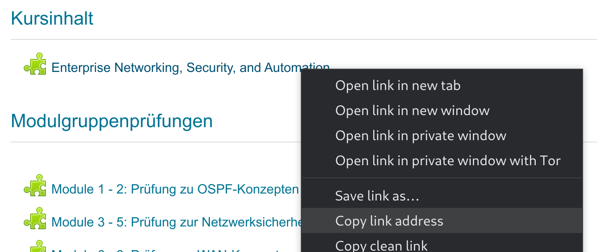

# ccna-dl

A simple tool for downloading your CCNA course from the website.

## OUT OF DATE

This downloader seems to be broken by now ([#1](/../../issues/1)). I won't fix it, but would accept PRs or transfer the npm package.

## Features

- download the whole course contents
- clicks through carousels and stacks their contents
- does _not_ work for videos

## Run this tool

- Install [Node.js + npm](https://nodejs.org/)
- `npx ccna-dl --help`

## Usage

- Head to [netacad.com](netacad.com)
- Launch your course
- Copy the link that leads to the course contents (not the link in the address bar):  
  
- `npx ccna-dl -u <YOUR_EMAIL> <COURSE_URL>`

## Disclaimer

This project is only for educational purposes. Don't download stuff with this tool please.
